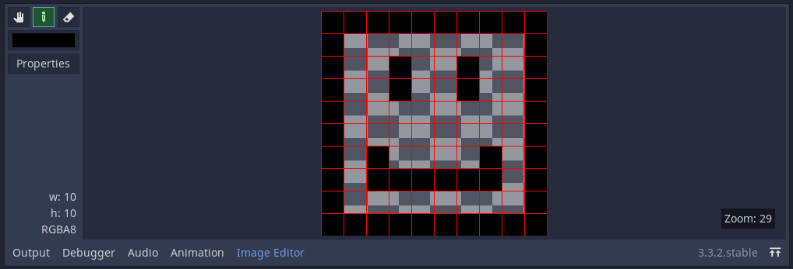
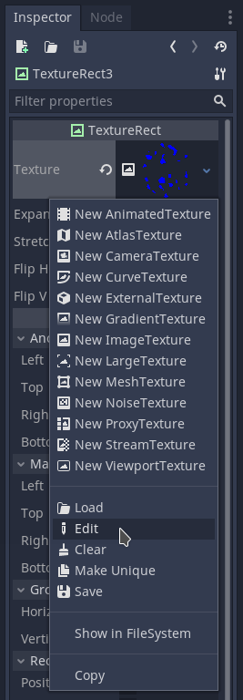
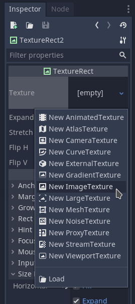

# Godot `ImageTexture` editor plugin

Simple plugin for editing `ImageTexture` resources pixel by pixel.

## Features

This plugin provides following capabilities:

* Drawing and erasing pixels of `ImageTexture` resources
* Resizing `ImageTexture` resources
* Creating `ImageTexture` resources from scratch (by resizing empty `ImageTexture` resource)

## Caveats

This plugin has no `undo` mechanism yet so the `resize` operation must be used with care.

## Installation

1. Get the contents of this repository to your project's `res://addons/godot-image-editor-plugin/` directory:
    * either download
    * or clone
    * or add as a submodule: `git submodule add https://github.com/lampe-games/godot-image-editor-plugin.git addons/godot-image-editor-plugin`
2. Enable plugin in `Project Settings/Plugins`

## Usage

After enabling the plugin in the `Project Settings`, click `Edit` on any `ImageTexture` resource and the `Image Editor` section will be added to the editor's bottom panel next to `Output`, `Debugger` etc.

In case you don't have any `ImageTexture` resource available, you need to create one before you can `Edit` it.

If you've created `ImageTexture` from scratch, you will have to use `Properties` button within `Image Editor` to resize (and hence create) the underlying `Image`.
